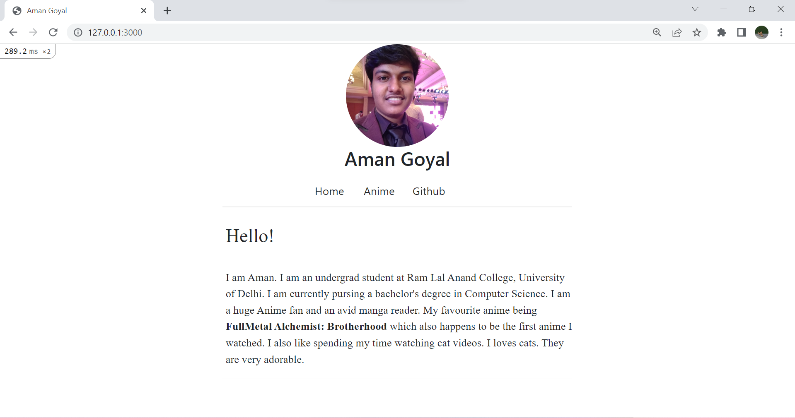
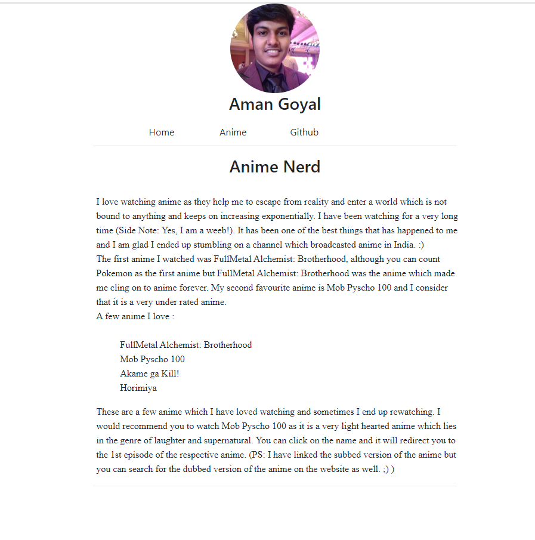

This is a personal website which is made using Ruby on Rails. It consists of three sections:  
The front page which consists of basic information about such as where do I study? Which course am I pursuing? My hobbies. 
 The second section consists information about me being an anime nerd and also a list of my all time favourites (which I would recommend you to watch as well)  
The third section will lead you to my GitHub account where you are reading this. 
I hope this gave you a brief description of this website. It was my first attempt at making a website using Ruby on Rails and I am looking forward to building more projects using this wonderful language. :)
